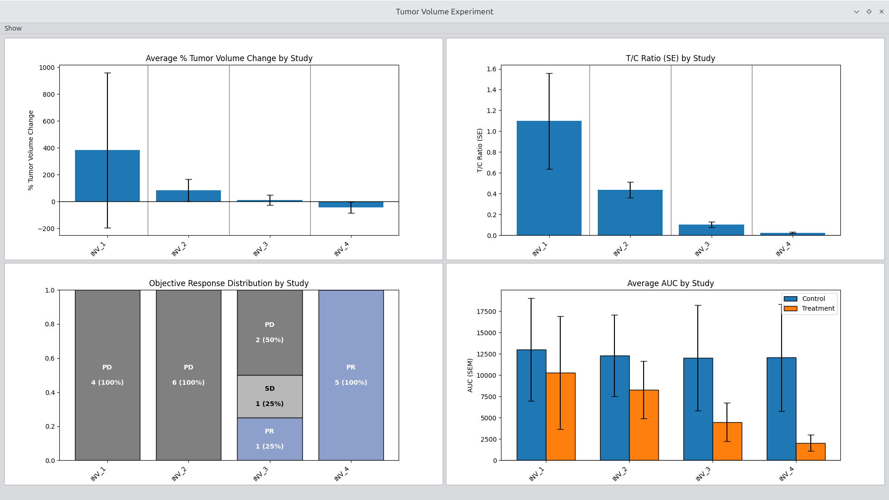
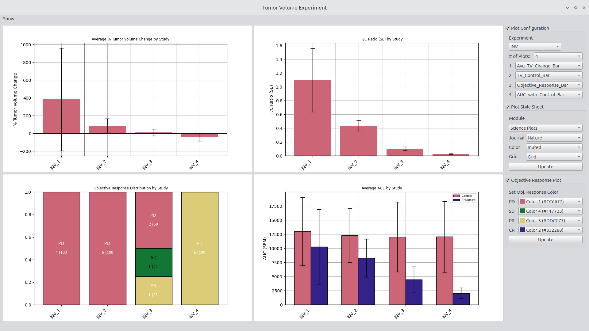
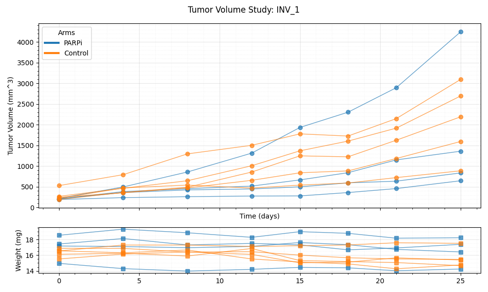
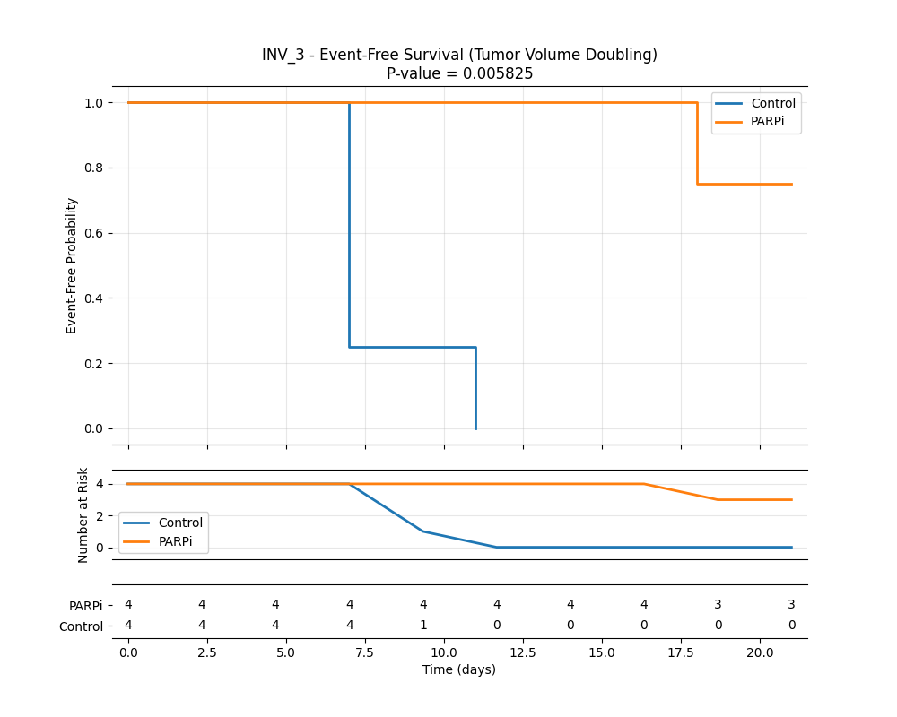
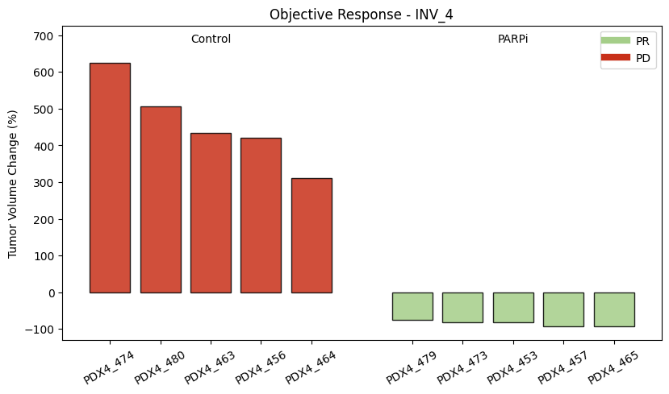

# Tumor Volumetrics

**Tumor Volumetrics** is an early-stage Python application for loading, validating, analyzing, summarizing, and visualizing tumor volume time-series data.  
The repository includes the foundations of a data access layer and specialized classes for working with preclinical tumor growth measurements.

The motivation is to provide a framework for **quickly integrating new analytical methods** and applying them to existing data. The Python implementation is intended to help **biologists, statisticians, and engineers** rapidly test, refine, and deploy methods during study evaluation.

This repository is under active development and does not yet represent a stable API.

---

## Main Interface

### Tumor Volume Classes

The core component under development is the *[TumorVolumeTimeSeriesClass](src/media/TumorVolumeClassReadMe.md)*, which supports data verification, metadata inspection, summaries, and basic tumor-volume plots. The file includes the following class structures:

- **Tumor Volume Data Class**  
  Loads tumor volume time-series data from CSV. Includes utilities for logging summaries and input checks.

- **Tumor Volume Experiment Class**  
  Groups studies by experiment, enabling cross-study visualization and comparisons.

- **Tumor Volume Study Class**  
  Organizes data at the study level. Supports summaries, group-level plots, and metadata inspection.

- **Tumor Volume Time Series Class**  
  Focused on individual mouse-level series with basic plotting, QC, and summaries.

A design requirement for all classes is flexibility: they support **command-line use, interactive workflows, and GUI-driven analysis**.

    
 
<b>Figure 1.</b> Configurable experiment view.

    
 
<b>Figure 2.</b> Configurable experiment view with configuration options shown.

---

## Load Tumor Volume File Grouping

The file-loading panel includes commands for file access, viewing, and export. Each row of the CSV represents a **single time point** for a specific animal. The test file includes additional fields to support interactive plotting.

Key actions:

- **Open** – Select and load a tumor volume CSV following published conventions.  
- **Show** – Display the entire CSV in a table widget (sorting, copying, and basic inspection supported; validation tools planned).  
- **Save** – Export the CSV as XML following the provided [XML schema](TumorVolumeData.xsd), which defines `Contributors` and `Experiments` as root elements.

The XML format is intentionally extensible. For example, units, mouse strain, and tumor-specific details can be included for downstream or custom analyses.

    
 
<b>Figure 3.</b> Simplified interface enables rapid access and visualization.

---

## Show Grouping

The *Show* panel provides quick navigation of loaded data using combo boxes for selecting contributor, disease, experiment, study, arm, and individual time series. Currently, selecting and displaying an item reveals the underlying CSV rows. Interactive plotting tools for experiments and subgroups are under active development.

    
 
<b>Figure 4.</b> File selection and inspection interface.</b>

---

## Figure Examples

    
 
<b>Figure 5.</b> Tumor volume spider plots with weights.

    
 
<b>Figure 6.</b> Average tumor volume curves with standard deviation.

    
  
<b>Figure 7.</b> Event-free Kaplan–Meier curve with at-risk table.

    
 
<b>Figure 8.</b> Change in tumor volume plotted as objective response.

---

## Motivation

*The Tumor Volume Analysis Suite provides a consistent, efficient, and user-friendly interface for common oncology data analyses. It minimizes friction in loading datasets, exploring experiments, and generating publication-ready visualizations. By standardizing commonly used plots and simplifying figure generation, the tool saves time across research teams and frees effort for scientific interpretation and method development.*

---

## Features in Progress

- Extensible XML schema for metadata-rich saving of tumor volume datasets  
- Enhanced CSV validation and interactive sorting tools  
- Expanded plotting options for arms, studies, and experiments  

---

## Roadmap

The long-term plan is to build a comprehensive PySide6 application that supports biologists, analysts, and engineers throughout **data collection, QC, exploration, analysis, and manuscript preparation**.

Key goals:

- Common preclinical oncology analyses available interactively  
- Simple extension points for advanced or lab-specific plots  
- XML format supporting metadata such as genomic file locations  
- Rapid export of publication-quality figures with configurable settings  
- Support for expanded visualization aesthetics and statistical summaries  
- Built-in QC tools for raw tumor volume data

Optional collaboration will be considered once the application stabilizes.

---

## License

This project is licensed under the **GNU Affero General Public License v3.0**.  
See the [LICENSE.md](LICENSE.md) file for details.
