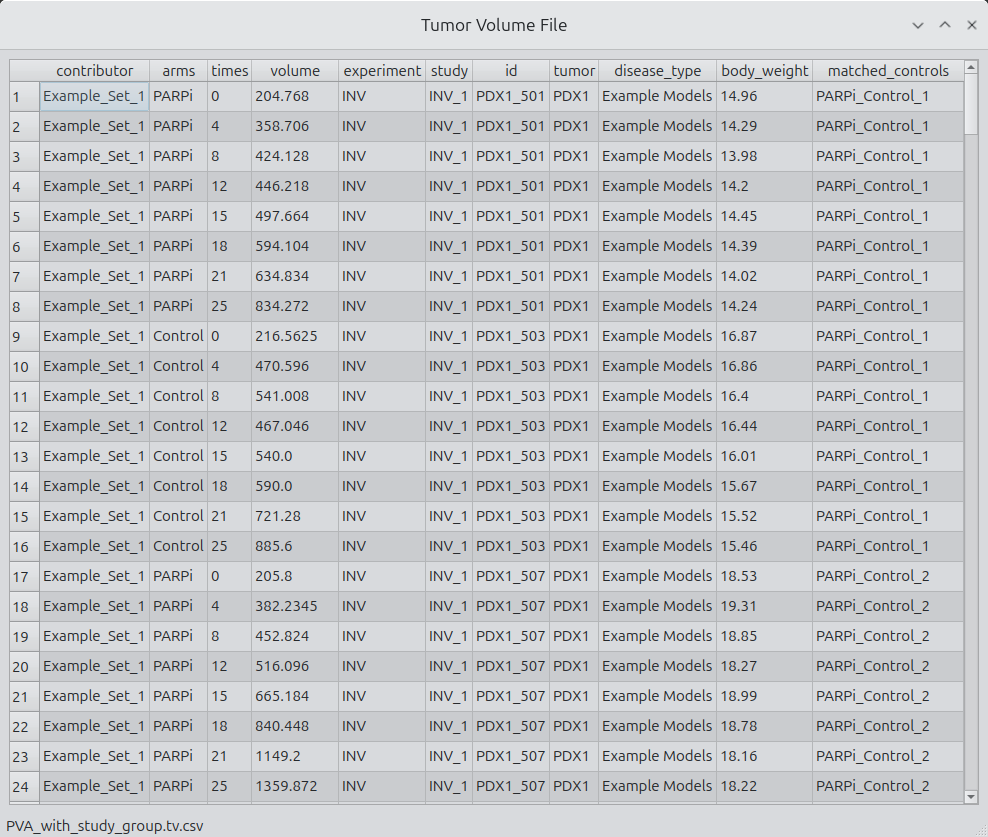

# Tumor Volumetrics

**Tumor Volumetrics** is an early-stage Python application for loading, validating, analyzing, summarizing, and visualizing tumor volume time series data.
The repository currently includes the foundations of a data access layer and specialized classes for working with tumor growth measurements.

The motivation is to have a framwork for quickly integrating new advance methods for use on existing data sets. We expect the python code will enable statsitician and engineers to quickly test and deploy methods under development.

The first component under development is the *[TumorVolumeTimeSeriesClass](media/TumorVolumeClassReadMe.md)*, which enables users to verify their data, inspect metadata, and generate basic plots of tumor volume and optional weight over time. As the project matures, additional modules for data QC, normalization, group-level summaries, and interactive visualization will be added.

This repository is under active development and does not yet represent a stable API. More features, documentation, and examples will follow.

## Features (in progress)

- Load tumor volume datasets from CSV files
- Creation of individual tumor time-series objects
- Creation of tumor volume study objects
- Creattion of tumor volume experiment objects
- Graphic user interface for interactively visualizing and analyuzing tumor volume data

## Main Interface
### Load tumor volume file grouping
Load tumor volume file group include file  and data viewing commands. The key feature of the data file is that 
each row contains measurements at a single time point. The included test file includes additional 
information that will facilitate interactive data plotting. 

- The Open button enables selection and loading of a tumor volume csv file as described in publications listed below. T
- The Show Button opens a table that contains the CSV file. Simple functions such as copying are enabled. Future versions will enable smart sorting, checking, and validating. 
- The Save button saves the CSV file as an XML file with a schema that includes Contributors and experiments as a root node. 

Including an XML format is an exercise in developing an extensible format that can include additional information required for custom examples. For example, the internal functions includes options for specifying units explicitly. Mouse strain and additional information about the tumor could be included.

    
 
<b>Figure 1.</b> Simplified interface enables rapid access and visualization.

### Show grouping
The show grouping include a simplified way to select and display a specific component of the data files. The grouping includes combo boxes to select contributor, disease, experiment, study, arms, and sepcific tumor volume time series. Currently, selecting the associated push button results in displaying the CSV file. 

The ability to plot experiments is underdevelopment.

    
 
<b>Figure 2.</b> Simplified interface enables rapid access and visualization.

## Figure Examples

    
 
<b>Figure.</b> Tumor volume spider plots with weights shown as a subplot.

    
 
<b>Figure.</b> Average tumor volume curves with standard deviation shown.

    
  
<b>Figure.</b> Event Free Kaplan Meier curve with at risk shown.

    
 
<b>Figure.</b> Change in tumor volume plotted as objectiv response.

## Motivation

*The Tumor Volume Analysis Suite provides a consistent, fast, and user-friendly interface for the most common oncology data analyses. It removes friction in loading data, exploring experiments, and generating publication-ready visualizations. By standardizing common plots and making them easy to export and customize, the tool reduces wasted effort across research groups and frees time to focus on new methods and deeper scientific insight.*

## Roadmap

The plan is to create a PySide6 interface that will allow for interactive review of analysis of tumor volume data. Interactive analysis will support a range of researchers during the data collection, analysis, and publishing stages. The application will include the most common starting analysis. We expect it will be stratight forward for those with appropraite experience to add less commonly used figures and analytsis. 

The starting point will use existing flat file formats. We expect to develop an XML format that will allow for additiona information to be included such as location of the genomics data. 

A major feature of the application will be the ability to export publication quality features and to reapidly configures figure properties. We expect supporting figure foramting will enable a wide range of users to customize figures according to group standards. 

Future updates will include:
- Expanded plotting aesthetics
- Quality control checks for raw data
- Enhanced statistical summaries
- Interactive visualization tools

Optional collaboration once the application is fully developed

## License

This project is [licensed](LICENSE.md) under the GNU Affero General Public License v3.0.
See the LICENSE.md file for details.