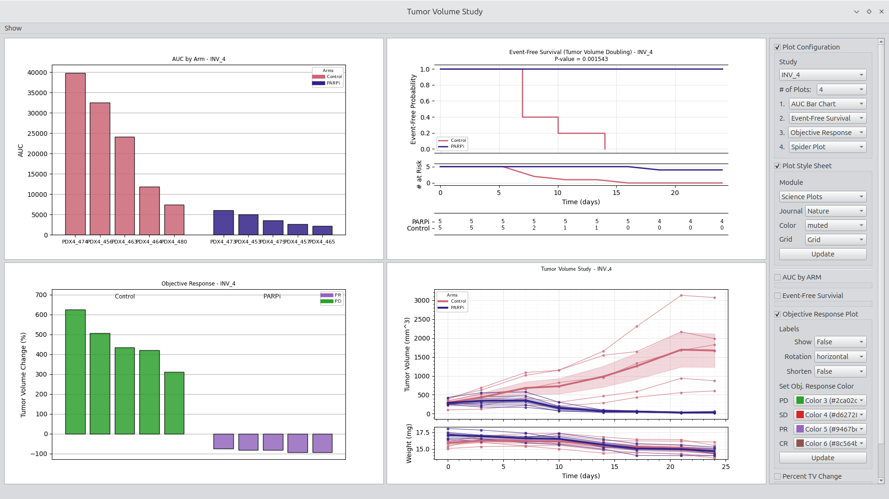
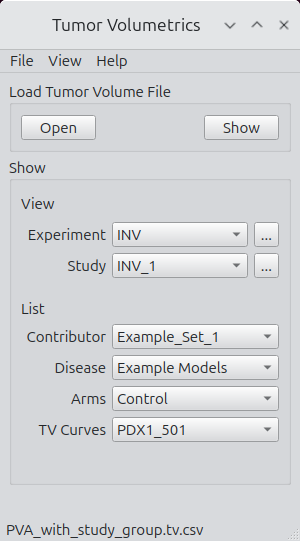
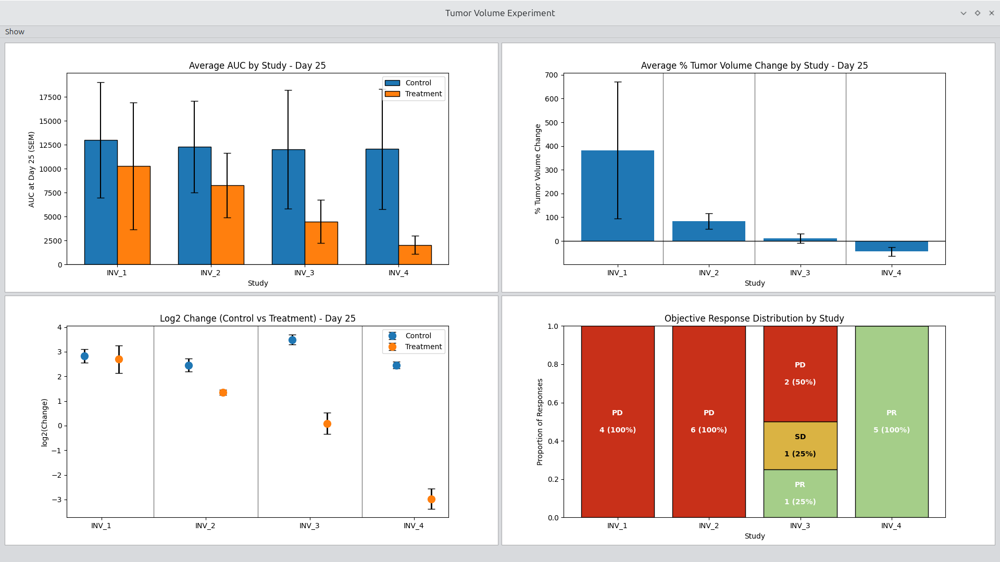
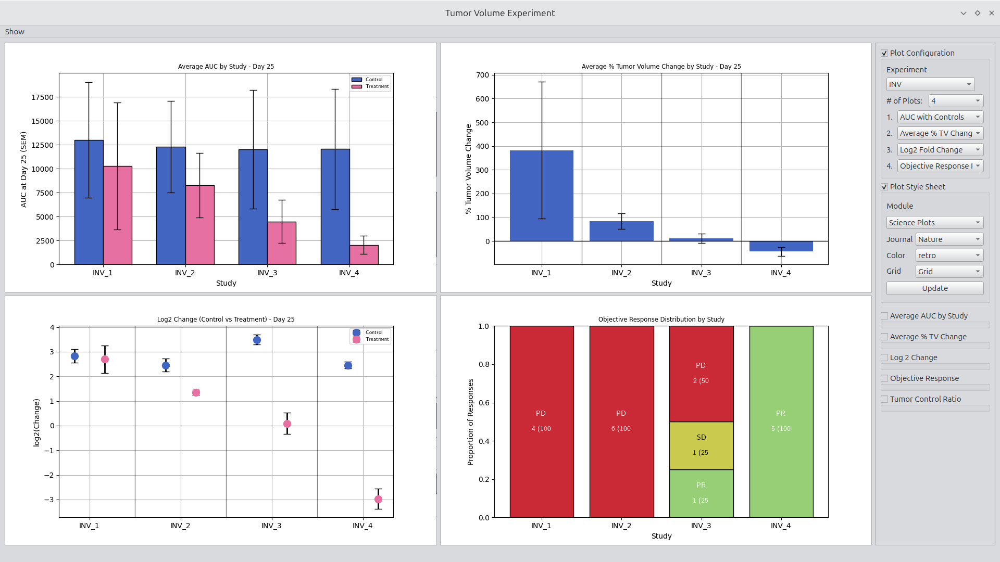
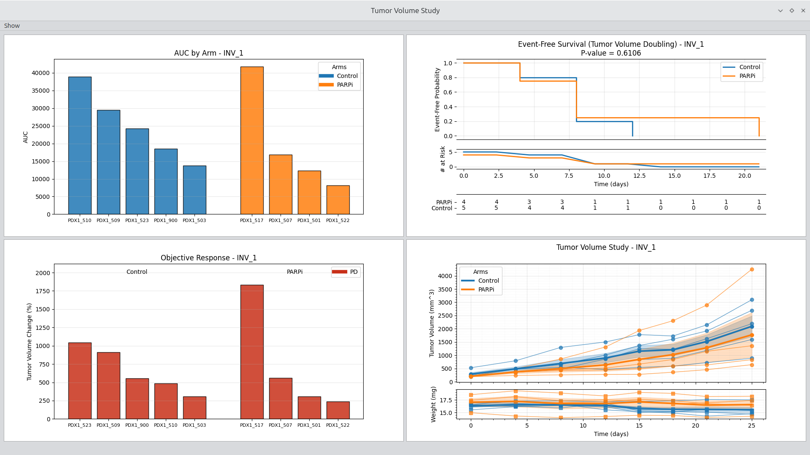
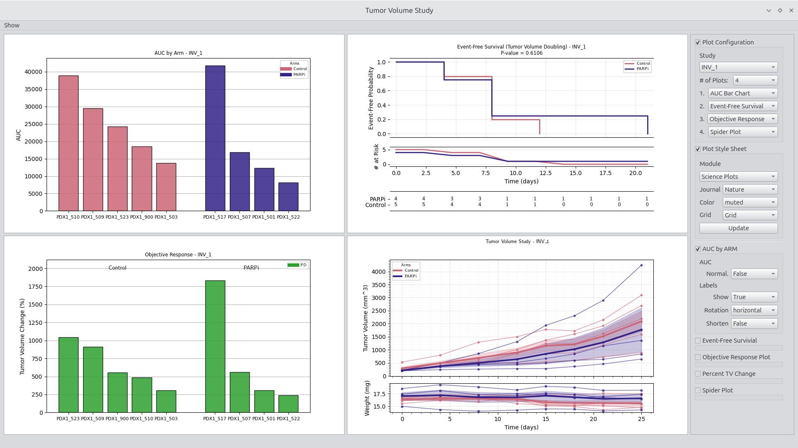

# Tumor Volumetrics

**Tumor Volumetrics** is a Python application for exploring, summarizing, and visualizing preclinical tumor volume time-series data. It is designed to make it **fast and consistent to generate standard tumor volume figures** across experiments and studies.

The primary focus of the project is now the **Tumor Experiment Viewer and the Tumor Volume Study Viewer**, which provide interactive, configurable access to common oncology plots such as spider plots, group averages, Kaplan–Meier curves, and objective response visualizations.

This repository is under active development. The user-facing viewers are the most mature components. Internal class structures are evolving and are treated as implementation details. 

--

## What This Tool Is For

The primary goals of the interface is to standardize and excellerate the generation of publication quality figures directly from the interface. Right clicking on a figure launches a diaglog box that allows figure configutration, copying the figure, and saving the figure. figure widgth, length, and dpi are easily set. 

Tumor Volumetrics is built for scientists and analysts who:
- Work with longitudinal tumor volume data in CSV form
- Need to rapidly explore experiments and studies

The goal is to remove friction from common tasks like:
- Loading, inspecting, and plotting tumor volume datasets
- Automatically applying styles across plots which sets up the infastructure for defining custom plot configurations.

--

## Main User Interfaces
The primary goal of the interfaces is to make common tumor figures quickly aviallbe allowing the user to move quickly to reviewinhg data. Currently, the interface supports experiment and study centrics views of the data.

   <b>Figure 1.</b> Study viewer with effective treatment example shown. Viewer configuration and plottingg style options are shown on the upper right. Options available for the objective response plot  

## File Loading and Grouping

The file-loading panel supports basic access, inspection, and export.

Key actions:
- **Open**
  Select and load a tumor volume CSV following standard conventions.
- **Show**
  Display the entire CSV in a table widget. Sorting, copying, and basic inspection are supported. Additional validation tools are planned.
- **Save**
  Export the dataset as XML following the provided schema, which defines Contributors and Experiments as root elements.

The XML format is intentionally extensible. It supports additional metadata such as units, mouse strain, or tumor-specific details for downstream analysis.

   <b>Figure 5.</b> Main interface for file access and navigation. 

## Grouping and Navigation

The grouping panel allows quick navigation using combo boxes for:
- Contributor
- Disease
- Experiment
- Study
-  Arm
- Individual time series

Selecting an item displays the corresponding rows from the underlying CSV. This provides a fast way to confirm data structure and content before plotting.

   <b>Figure 6.</b> File selection and inspection interface. 

## Main User Interfaces
The primary goal of the interfaces is to make common tumor figures quickly aviallbe allowing the user to move quickly to reviewinhg data. Currently, the interface supports experiment and study centrics views of the data.

### Tumor Volume Experiment Viewer

The Experiment Viewer is optimized for cross-study and cross-arm exploration within an experiment. It allows you to quickly configure and generate standard tumor volume plots with minimal setup.

   <b>Figure 1.</b> Tumor Volume Experiment Viewer. 
 

   <b>Figure 2.</b> Experiment Viewer with configuration options shown. 

Key capabilities:
- Select experiment, study, and arm combinations
- Generate spider plots, averages, and other standard views
- Adjust plotting options interactively
- Rapidly iterate on figure configuration without code changes

This viewer is intended for experiment-level review and comparison.

### Tumor Volume Study Viewer

The Study Viewer focuses on **deep inspection of a single study**. It supports arm-level and subject-level exploration and is optimized for understanding response patterns and variability.

   <b>Figure 3.</b> Tumor Volume Study Viewer. 
 

   <b>Figure 4.</b> Study Viewer with option settings shown. 

Key capabilities:
- Explore arms and individual time series
- Generate standard study-level plots
- Configure display and grouping options interactively
- Support common review patterns used in study evaluation

This viewer is intended for ** study-level analysis and interpretation **.

## Design Philosophy

Tumor Volumetrics is built around a few core ideas:

- **User first, architecture second**
  The viewers and workflows drive the design. Internal class structure is flexible and evolving.
- **Standard plots should be easy**
  Common oncology figures should not require custom scripts every time.
- **Interactive over batch by default**
  The GUI is the primary interface. Programmatic access is supported but not the main focus.
- **Extensible, not rigid**
  New plot types and lab-specific conventions should be easy to add.

## Internal Architecture (Background)
- Under the hood, the application uses a set of classes for:
- Tumor volume data loading and validation
- Experiment-level grouping
- Study-level organization
- Individual time series handling

These are designed to support command-line, interactive, and GUI-driven use. They are not currently treated as a stable public API and may change as the viewers continue to mature.

If you are interested in the class structure, see the [Tumor Volume Class Read Me](src/media/TumorVolumeClassReadMe.md). 

## Features in Progress
- Enhanced CSV validation and QC tooling
- Richer XML metadata support

## Roadmap

The long-term goal is a comprehensive PySide6 application that supports:

Data loading and QC
- Standard preclinical oncology analyses
- Rapid generation of publication-quality figures
- Simple extension points for advanced or lab-specific methods

The emphasis will remain on **practical workflows used during study review, team discussions, and manuscript preparation**.

## License

This project is licensed under the GNU Affero General Public License v3.0.
See the LICENSE.md file for details.