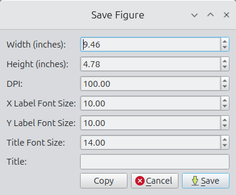
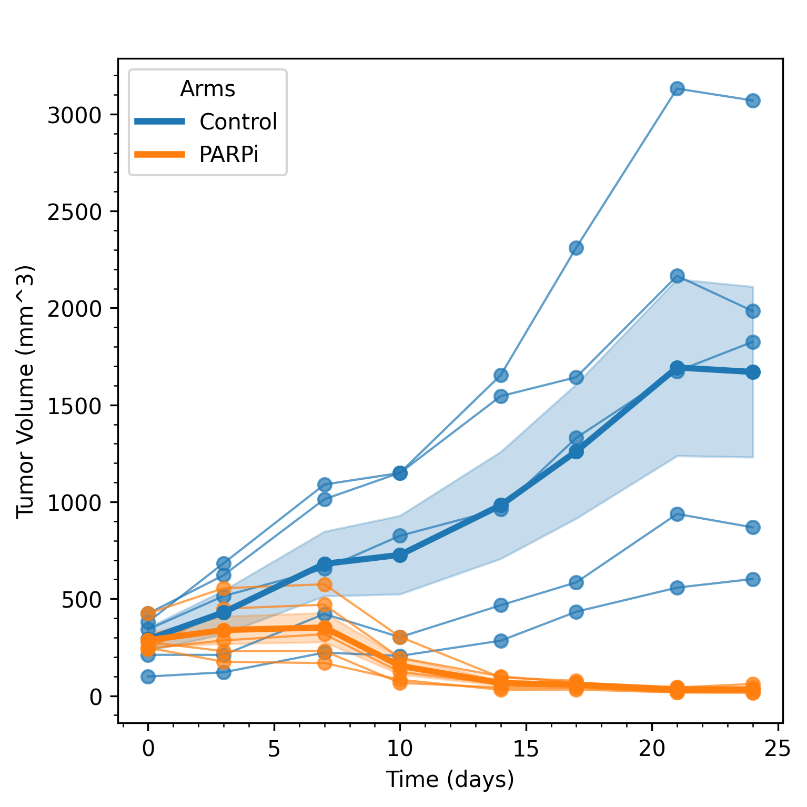

# Tumor Volumetrics

**Tumor Volumetrics** is a Python application for exploring, summarizing, and visualizing preclinical tumor volume time-series data. It is designed to make it easy to **generate standard tumor volume figures** to support interactive review of results and generation of publication-quality figures.

   <b>Figure 1.</b> Study viewer with effective treatment example shown. Viewer configuration and plotting style options are shown on the upper right. Options available for the objective response plot are shown on the lower right.

Launching a viewer such as the volume study viewer requires only one click, resulting in the display of common tumor volume plots. The viewer can be configured between 1 and 4 figures. In addition, each figure includes a set of parameters made available through a group box. Configuration and parameter options are made available through the Show menu on the upper left corner. See **Figure 1** for an example of a typical study view display.

---

## What This Tool Is For

Tumor Volumetrics is built for scientists and analysts who:

- Work with longitudinal tumor volume data in CSV form
- Need to rapidly explore common experiment and study plots
- Generate publication-quality plots

### Figure Generation

Users can select a Matplotlib or Science Plot style to update the displayed figures. Objective Response Plots include a feature of smart generation of colors complementary to the selected style. 

Right-clicking any figure launches a dialog box for configuring plots including plot width, plot height, and figure DPI. The figure can then either be saved to disk or copied to the clipboard. See **Figure 2** for an example.

  
    
  
   
  <b>Figure 2.</b> Example of setting plot parameters (top) and generating a square plot (bottom).

---

## Main User Interfaces

TumorVolumetrics includes interfaces for loading data files, visualizing experiment data, and visualizing study data. Interfaces are minimal by design, allowing the user to focus on data review.

### File Loading and Grouping

The file-loading panel supports basic access, inspection, and export.

Key actions:
- **Open**  
  Select and load a tumor volume CSV following standard conventions.
- **Show**  
  Display the entire CSV in a table widget. Sorting, copying, and basic inspection are supported. Additional validation tools are planned.
- **Experiment Viewer**  
  Clicking on the ellipses next to the experiment list launches the experiment viewer.
- **Study Viewer**  
  Clicking on the ellipses next to the study list launches the study viewer.
- **Lists**  
  Contributor, disease, arms, and tumor volume curve lists are populated upon loading.

   <b>Figure 3.</b> Main interface for file access and navigation. 

### Show

Clicking on the show pushbutton launches a CSV viewer with the selected data file contents shown.

   <b>Figure 4.</b> File selection and inspection interface. 

### Tumor Volume Experiment Viewer

The Experiment Viewer is optimized for cross-study and cross-arm exploration within an experiment. It allows you to quickly configure and generate standard tumor volume plots with minimal setup.

   <b>Figure 5.</b> Tumor Volume Experiment Viewer. 
 

Key capabilities:
- Select experiment, study, and arm combinations
- Generate spider plots, averages, and other standard views
- Adjust plotting options interactively
- Rapidly iterate on figure configuration without code changes

### Tumor Volume Study Viewer

The Study Viewer focuses on **deep inspection of a single study**. It supports arm-level and subject-level exploration and is optimized for understanding response patterns and variability.

   <b>Figure 6.</b> Tumor Volume Study Viewer. 
 

Key capabilities:
- Explore arms and individual time series
- Generate standard study-level plots
- Configure display and grouping options interactively
- Support common review patterns used in study evaluation

---

## Design Philosophy

Tumor Volumetrics is built around a few core ideas:

- **User first**  
  The viewers and workflows interface drive the design.
- **Standard plots should be easy**  
  Common oncology figures should not require custom scripts every time.
- **Extensible, not rigid**  
  New plot types and lab-specific conventions should be easy to add.
- **Scripting supportive classes**
  Advance users can use classes to conduct analysis.
  See [TumorVolumeClassReadMe.md](src/media/TumorVolumeClassReadMe.md) for more details

---

## Roadmap

The long-term goal is a comprehensive PySide6 application that supports:

- Extended XML data format for including metadata with tumor volume data
- Extension points for advanced or lab-specific methods
- Standard preclinical oncology analyses
- Support for user-defined plot configuration

---

## License

This project is licensed under the GNU Affero General Public License v3.0.  
See the LICENSE.md file for details.