# TumorVolumeClass.py Read Me

A Python module for loading, analyzing, and visualizing tumor volume time-series data from patient-derived xenograft (PDX) studies.

## Overview

This tool provides a comprehensive framework for working with tumor volume data, enabling researchers to:
- Load and organize multi-arm preclinical study data
- Analyze individual tumor growth curves and study-level metrics
- Generate publication-ready visualizations
- Compute objective response classifications (CR/PR/SD/PD)
- Perform survival analysis and statistical comparisons

## Features

### Data Management
- **CSV data loading** with automatic validation
- **Hierarchical organization**: Individual time series → Studies → Experimental groups
- **Metadata tracking**: Arms, contributors, PDX IDs, disease types

### Analysis Capabilities
- Area Under the Curve (AUC) calculations
- Percent change and proportional volume change metrics
- Objective response classification (Complete/Partial Response, Stable/Progressive Disease)
- Event-free survival analysis with Kaplan-Meier curves
- Log-rank statistical testing

### Visualizations
- **Individual plots**: Time series with tumor volume and weight
- **Spider plots**: Multi-arm studies with individual and aggregate curves
- **Bar charts**: AUC and tumor volume change comparisons
- **Survival curves**: Event-free survival with at-risk tables
- **Waterfall plots**: Objective response by treatment arm

## Quick Start

```python
from tumor_volume import TumorVolumeDataClass

# Load data
tvd = TumorVolumeDataClass()
tvd.load_tmz_csv("your_data.csv")

# Summarize dataset
tvd.write_file_summary_text()

# Plot individual time series
pdx_id = tvd.unique_pdx_ids[0]
tvd.tumor_vol_time_series_dict[pdx_id].plot()

# Visualize study with spider plot
study = tvd.unique_studies[0]
tvd.tumor_vol_study_dict[study].plot_spider(
    show_individual=True,
    show_aggregate=True,
    aggregate_sem=True
)

# Generate survival curves
tvd.tumor_vol_study_dict[study].plot_event_free_survival(delta=1.0)
```

## Data Format

CSV files should include these columns:
- `contributor`, `arms`, `times`, `volume`, `experimental_group`
- `study`, `id`, `tumor`, `disease_type`
- `body_weight`, `matched_controls`

## Requirements

- Python 3.7+
- pandas, numpy, scipy
- matplotlib
- lifelines (for survival analysis)

## Figure Examples

### Time Series Class Figures
<p align="center">    
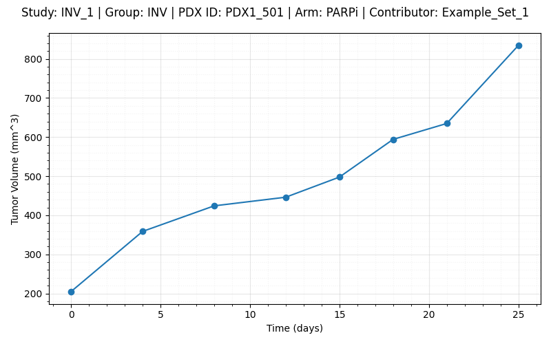<br>
<b>Figure 1.</b> Example tumor volume plot.
</p>

<p align="center">    
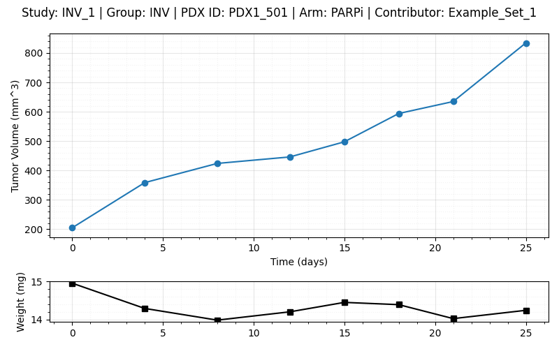<br>
<b>Figure 2.</b> Example tumor volume plot with weights subplot.
</p>

<p align="center">    
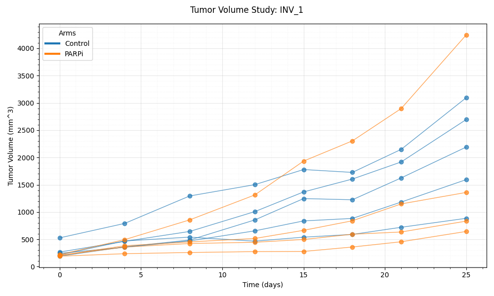<br>
<b>Figure 3.</b> Tumor volume spider plot.
</p>

<p align="center">    
<br>
<b>Figure 4.</b> Tumor volume spider plots with weights shown as a subplot.
</p>

<p align="center">    
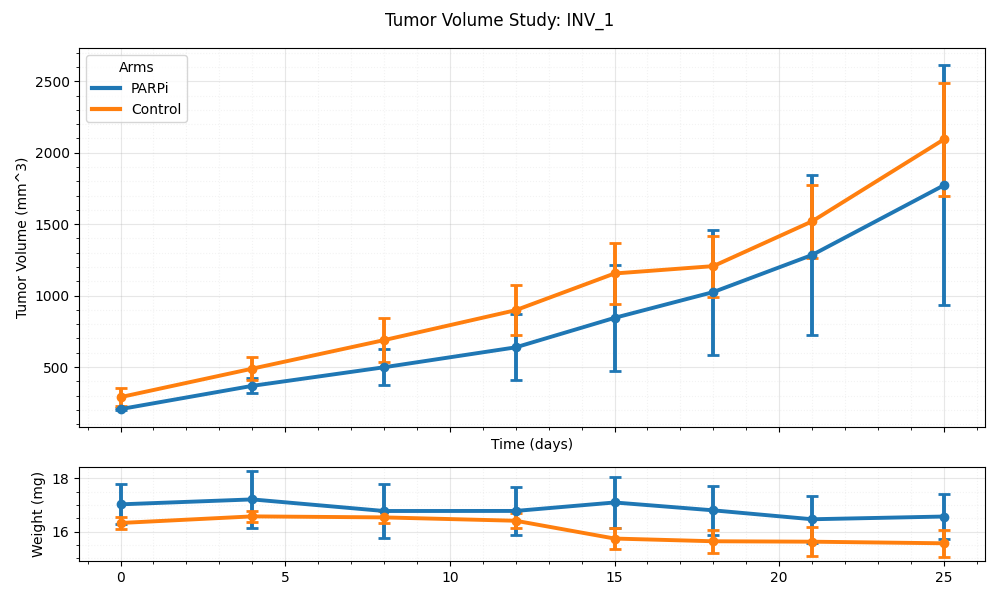<br>
<b>Figure 5.</b> Average tumor volume curves with error bars.
</p>


<p align="center">    
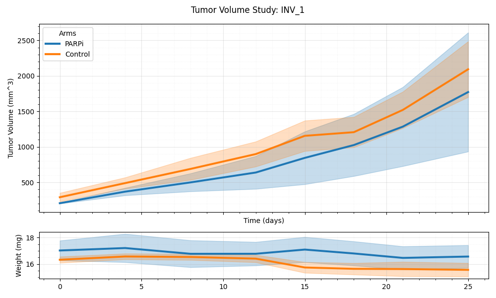<br>
<b>Figure 6.</b> Average tumor volume curves with standard deviation shown.
</p>

### Study Class Figures

<p align="center">    
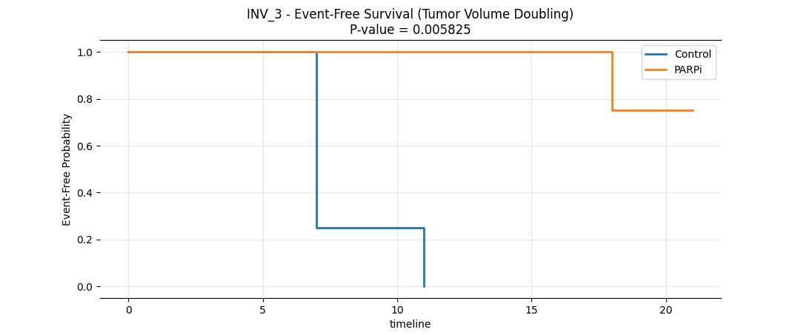<br>
<b>Figure 7.</b> Event Free Kaplan Meier curve.
</p>

<p align="center">    
 <br>
<b>Figure 8.</b> Event Free Kaplan Meier curve with at risk shown.
</p>

<div align="center">

<table>
  <tr>
    <td>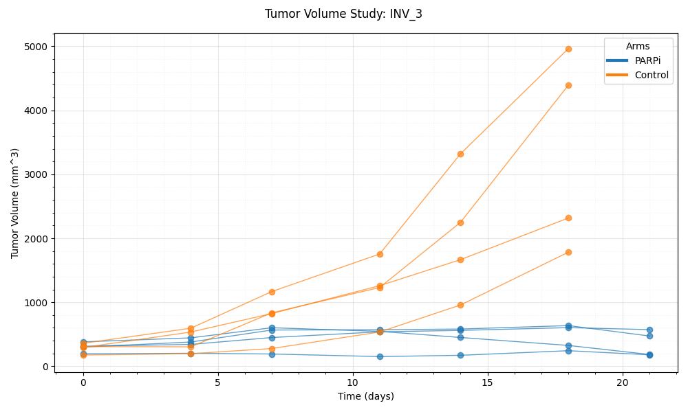</td>
    <td>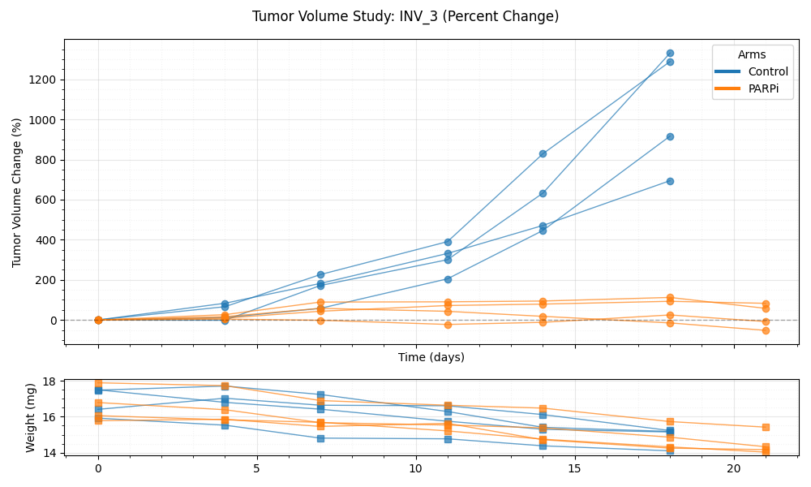</td>
  </tr>
  <tr>
    <td>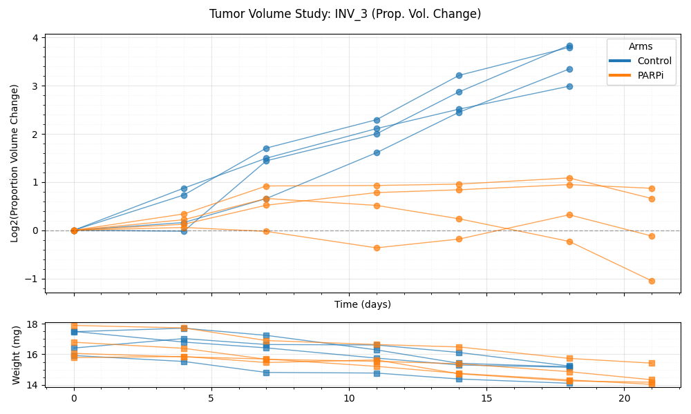</td>
    <td>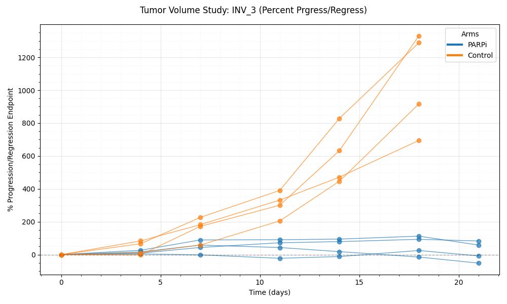</td>
  </tr>
</table>
<p align="center">
<b>Figure 9.</b> Common tumor volume transformations.
</p>
</div>

<p align="center">    
<br>
<b>Figure 10.</b> Change in tumor volume as a percentage.
</p>


<p align="center">    
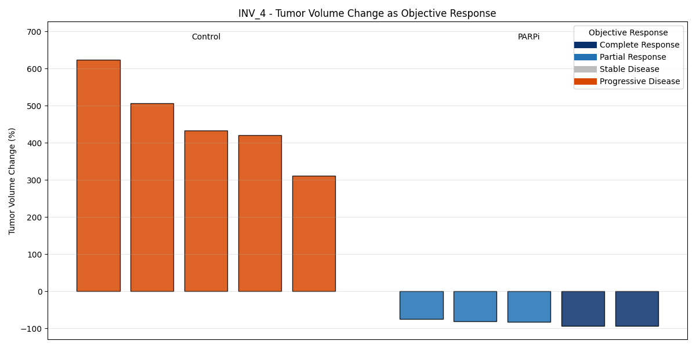<br>
<b>Figure 11.</b> Change in tumor volume plotted as objectiv response.
</p>

<p align="center">    
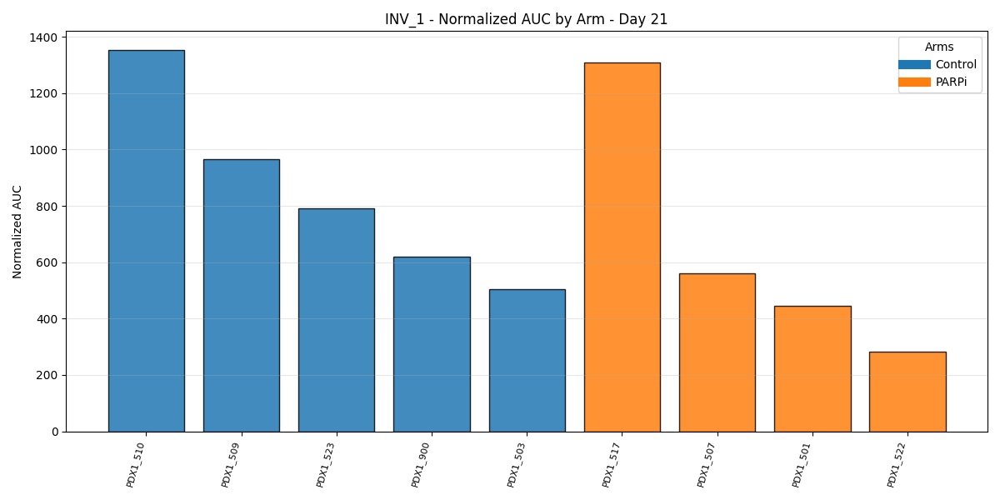 <br>
<b>Figure 12.</b> Area under the Tumor Volume Curve.
</p>

### Experiment Class Figures

<p align="center">    
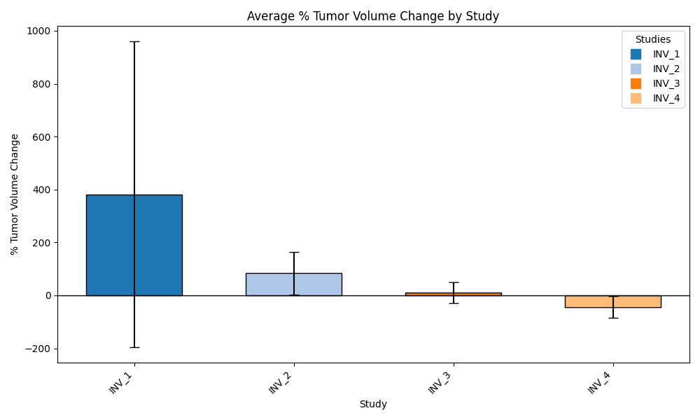 <br>
<b>Figure 13.</b> Percent tumor volume change across studies.
</p>

<p align="center">    
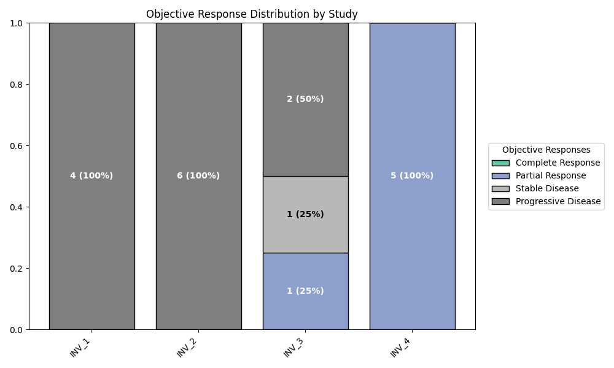 <br>
<b>Figure 14.</b> Log 2 change across studies.
</p>


<p align="center">    
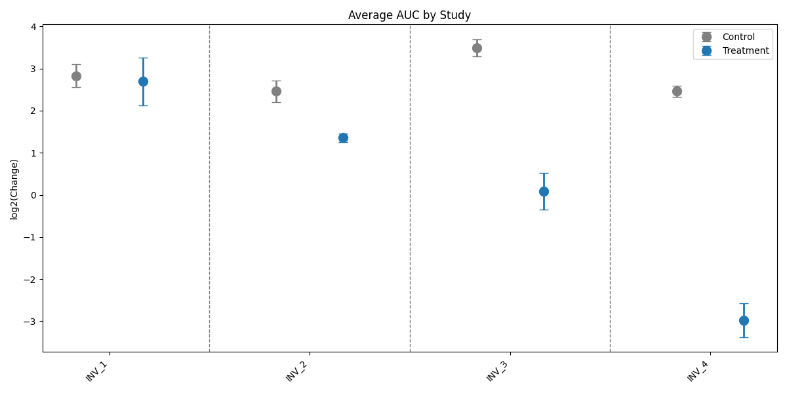 <br>
<b>Figure 15.</b> Log 2 change across studies.
</p>

<p align="center">    
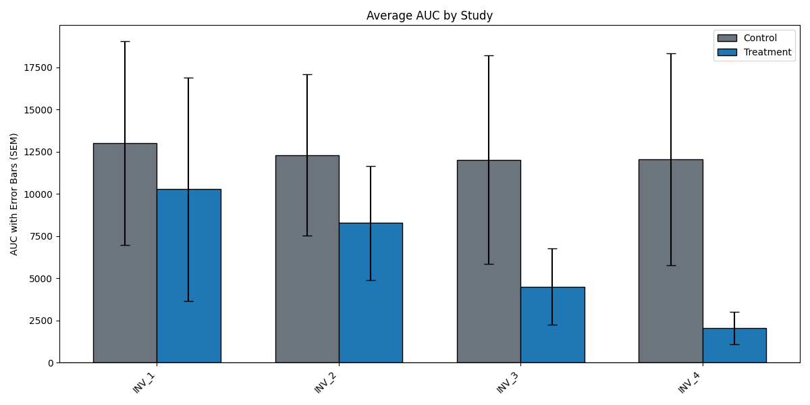 <br>
<b>Figure 16.</b> Average AUC across studies.
</p>

<p align="center">    
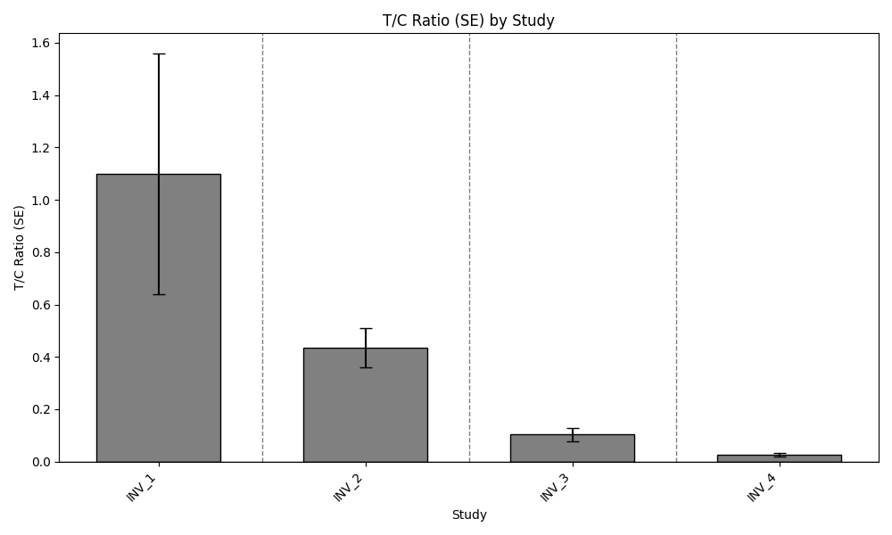 <br>
<b>Figure 17.</b> T/C Ratio across studies.
</p>

License
This project is licensed under the GNU Affero General Public License v3.0. See the LICENSE.md file for details.